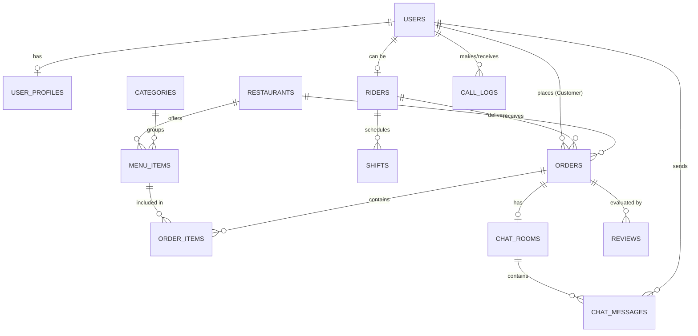

# Database Design Specification 🗄️

This document outlines the Relational Database Schema (PostgreSQL compatible) designed for the **Food Delivery System**, supporting the **Rider App**, **Customer Portal**, and **Admin Management Dashboard** as represented in the Figma designs.

---

## 📐 Entity Relationship Diagram (ERD)



---

## 🗂️ Data Dictionary & Schemas

### 1. Authentication & Users
Centralized storage for all users (Customers, Riders, Staff, and Admins).

#### `users`
Tracks core authentication details, status, and role access level.
| Column Name | Data Type | Constraints | Description |
| :--- | :--- | :--- | :--- |
| `id` | `UUID` | Primary Key, Default `gen_random_uuid()` | Unique identifier for each user |
| `phone_number` | `VARCHAR(20)` | Unique, Not Null | Primary identity (OTP login) |
| `email` | `VARCHAR(255)` | Unique, Nullable | Alternate login & receipt delivery |
| `password_hash`| `VARCHAR(255)` | Nullable | Encrypted password (for Admin/Staff logins) |
| `role` | `VARCHAR(20)` | Not Null | `customer`, `rider`, `staff`, `admin` |
| `status` | `VARCHAR(20)` | Not Null, Default `'active'` | `active`, `suspended`, `inactive` |
| `created_at` | `TIMESTAMP` | Not Null, Default `NOW()` | Account creation time |
| `updated_at` | `TIMESTAMP` | Not Null, Default `NOW()` | Last update time |

#### `user_profiles`
Holds non-security-related profile details.
| Column Name | Data Type | Constraints | Description |
| :--- | :--- | :--- | :--- |
| `id` | `UUID` | Primary Key | Matches `users.id` (1-to-1 relationship) |
| `first_name` | `VARCHAR(50)` | Not Null | User's first name |
| `last_name` | `VARCHAR(50)` | Not Null | User's last name |
| `avatar_url` | `TEXT` | Nullable | URL to profile picture stored in S3/Cloudinary |
| `created_at` | `TIMESTAMP` | Not Null, Default `NOW()` | Profile creation date |
| `updated_at` | `TIMESTAMP` | Not Null, Default `NOW()` | Profile last modification date |

---

### 2. Riders & Shift Management
Specifically supports the Rider App's shift booking, performance metrics, and real-time locations.

#### `riders`
Extends the user account with rider-specific metadata and vehicle credentials.
| Column Name | Data Type | Constraints | Description |
| :--- | :--- | :--- | :--- |
| `id` | `UUID` | Primary Key, Foreign Key (`users.id`) | Links to the `users` table |
| `vehicle_type` | `VARCHAR(20)` | Not Null | `bicycle`, `motorcycle`, `car` |
| `plate_number` | `VARCHAR(20)` | Nullable | Vehicle registration details |
| `is_online` | `BOOLEAN` | Default `FALSE` | Current online/offline toggle state |
| `latitude` | `DOUBLE PRECISION`| Nullable | Current live GPS latitude |
| `longitude` | `DOUBLE PRECISION`| Nullable | Current live GPS longitude |
| `rating` | `NUMERIC(3,2)` | Default `5.00` | Average rider rating (0.00 to 5.00) |
| `verification_status`| `VARCHAR(20)` | Default `'pending'` | `pending`, `verified`, `rejected` |
| `documents` | `JSONB` | Nullable | Holds URLs to driving license, national ID, etc. |

#### `shifts`
Tracks planned shifts and actual work logs for payment processing.
| Column Name | Data Type | Constraints | Description |
| :--- | :--- | :--- | :--- |
| `id` | `UUID` | Primary Key, Default `gen_random_uuid()` | Unique identifier for the shift |
| `rider_id` | `UUID` | Foreign Key (`riders.id`), Not Null | Associated rider |
| `start_time` | `TIMESTAMP` | Not Null | Shift scheduled start time |
| `end_time` | `TIMESTAMP` | Not Null | Shift scheduled end time |
| `status` | `VARCHAR(20)` | Default `'scheduled'` | `scheduled`, `checked_in`, `completed`, `missed` |
| `actual_start_time`| `TIMESTAMP` | Nullable | Time rider toggled 'online' inside the shift window |
| `actual_end_time` | `TIMESTAMP` | Nullable | Time rider completed/checked out |
| `estimated_earnings`| `NUMERIC(10,2)`| Default `0.00` | Estimated earnings for the scheduled shift |

---

### 3. Restaurants & Menu (Inventory System)
Allows the Admin to manipulate menus, categories, and track stock.

#### `restaurants`
Contains merchant listings.
| Column Name | Data Type | Constraints | Description |
| :--- | :--- | :--- | :--- |
| `id` | `UUID` | Primary Key, Default `gen_random_uuid()` | Unique store ID |
| `name` | `VARCHAR(100)` | Not Null | Restaurant name |
| `logo_url` | `TEXT` | Nullable | Restaurant logo image link |
| `address` | `TEXT` | Not Null | Physical address |
| `latitude` | `DOUBLE PRECISION`| Not Null | Map location latitude |
| `longitude` | `DOUBLE PRECISION`| Not Null | Map location longitude |
| `is_active` | `BOOLEAN` | Default `TRUE` | Store online status |
| `created_at` | `TIMESTAMP` | Default `NOW()` | Date added to database |

#### `categories`
Groups food items (e.g. Burgers, Drinks, Pizzas).
| Column Name | Data Type | Constraints | Description |
| :--- | :--- | :--- | :--- |
| `id` | `UUID` | Primary Key, Default `gen_random_uuid()` | Unique category ID |
| `restaurant_id`| `UUID` | Foreign Key (`restaurants.id`), Not Null | Owning restaurant |
| `name` | `VARCHAR(50)` | Not Null | Category name |
| `display_order`| `INT` | Default `0` | Controls sorting in UI list |

#### `menu_items`
Detailed products list including stock count for inventory.
| Column Name | Data Type | Constraints | Description |
| :--- | :--- | :--- | :--- |
| `id` | `UUID` | Primary Key, Default `gen_random_uuid()` | Unique item ID |
| `category_id` | `UUID` | Foreign Key (`categories.id`), Not Null | Associated category |
| `name` | `VARCHAR(100)` | Not Null | Product name |
| `description` | `TEXT` | Nullable | Product details |
| `price` | `NUMERIC(10,2)`| Not Null | Cost in local currency |
| `image_url` | `TEXT` | Nullable | Image path |
| `is_available` | `BOOLEAN` | Default `TRUE` | Out of stock/In stock toggle |
| `stock_count` | `INT` | Default `0` | Remaining stock level (Inventory check) |

---

### 4. Orders & Delivery Flows
Tracks transactions from customer checkout to driver drop-off.

#### `orders`
Primary order records.
| Column Name | Data Type | Constraints | Description |
| :--- | :--- | :--- | :--- |
| `id` | `UUID` | Primary Key, Default `gen_random_uuid()` | Unique order/invoice number |
| `customer_id` | `UUID` | Foreign Key (`users.id`), Not Null | Client who ordered |
| `restaurant_id`| `UUID` | Foreign Key (`restaurants.id`), Not Null | Shop receiving order |
| `rider_id` | `UUID` | Foreign Key (`riders.id`), Nullable | Assigned delivery rider |
| `status` | `VARCHAR(30)` | Default `'pending'` | `pending`, `accepted`, `preparing`, `ready_for_pickup`, `picked_up`, `delivered`, `cancelled` |
| `delivery_address`| `TEXT` | Not Null | Text description of delivery point |
| `delivery_lat` | `DOUBLE PRECISION`| Not Null | Map location latitude |
| `delivery_long`| `DOUBLE PRECISION`| Not Null | Map location longitude |
| `subtotal` | `NUMERIC(10,2)`| Not Null | Items price sum |
| `delivery_fee` | `NUMERIC(10,2)`| Not Null | Payment for delivery distance |
| `discount` | `NUMERIC(10,2)`| Default `0.00` | Discount applied via coupon |
| `total_amount` | `NUMERIC(10,2)`| Not Null | `subtotal + delivery_fee - discount` |
| `payment_method`| `VARCHAR(20)` | Not Null | `cash`, `card`, `mobile_wallet` |
| `payment_status`| `VARCHAR(20)` | Default `'pending'` | `pending`, `paid`, `failed`, `refunded` |
| `created_at` | `TIMESTAMP` | Default `NOW()` | Order placement time |
| `updated_at` | `TIMESTAMP` | Default `NOW()` | Last status update time |

#### `order_items`
Lists individual items contained inside an order.
| Column Name | Data Type | Constraints | Description |
| :--- | :--- | :--- | :--- |
| `id` | `UUID` | Primary Key, Default `gen_random_uuid()` | Unique line item identifier |
| `order_id` | `UUID` | Foreign Key (`orders.id`), On Delete Cascade | Associated order |
| `menu_item_id` | `UUID` | Foreign Key (`menu_items.id`), Not Null | Selected food item |
| `quantity` | `INT` | Not Null, Check (`quantity > 0`) | Ordered count |
| `price` | `NUMERIC(10,2)`| Not Null | Item price at checkout time |
| `notes` | `TEXT` | Nullable | Custom instructions (e.g. "No onions") |

---

### 5. Chat, Support & Call Logs

#### `chat_rooms`
Initiated whenever a rider is assigned to an order.
| Column Name | Data Type | Constraints | Description |
| :--- | :--- | :--- | :--- |
| `id` | `UUID` | Primary Key, Default `gen_random_uuid()` | Unique room ID |
| `order_id` | `UUID` | Foreign Key (`orders.id`), Not Null | Associated order reference |
| `is_active` | `BOOLEAN` | Default `TRUE` | Automatically set to `FALSE` when order finishes |

#### `chat_messages`
Individual support or order messages.
| Column Name | Data Type | Constraints | Description |
| :--- | :--- | :--- | :--- |
| `id` | `UUID` | Primary Key, Default `gen_random_uuid()` | Message ID |
| `room_id` | `UUID` | Foreign Key (`chat_rooms.id`), On Delete Cascade | Active chat room |
| `sender_id` | `UUID` | Foreign Key (`users.id`), Not Null | Message author |
| `message_text` | `TEXT` | Not Null | Text message body |
| `image_url` | `TEXT` | Nullable | Image attachments (if any) |
| `created_at` | `TIMESTAMP` | Default `NOW()` | Timestamp sent |

#### `call_logs`
Tracks support call metadata for the Admin Panel.
| Column Name | Data Type | Constraints | Description |
| :--- | :--- | :--- | :--- |
| `id` | `UUID` | Primary Key, Default `gen_random_uuid()` | Log ID |
| `caller_id` | `UUID` | Foreign Key (`users.id`), Not Null | Initiator |
| `receiver_id` | `UUID` | Foreign Key (`users.id`), Not Null | Recipient |
| `duration_seconds`| `INT` | Default `0` | Call duration |
| `status` | `VARCHAR(20)` | Not Null | `completed`, `missed`, `busy`, `failed` |
| `created_at` | `TIMESTAMP` | Default `NOW()` | Call start time |

---

### 6. Marketing & Reviews

#### `coupons`
System coupons generated by the admin dashboard campaign hub.
| Column Name | Data Type | Constraints | Description |
| :--- | :--- | :--- | :--- |
| `id` | `UUID` | Primary Key, Default `gen_random_uuid()` | Unique coupon ID |
| `code` | `VARCHAR(50)` | Unique, Not Null | Coupon code (e.g. `WELCOME10`) |
| `discount_type`| `VARCHAR(20)` | Not Null | `percentage`, `fixed` |
| `discount_value`| `NUMERIC(10,2)`| Not Null | Value (e.g., 10.00 for 10% or $10) |
| `min_order_value`| `NUMERIC(10,2)`| Default `0.00` | Minimum checkout total required |
| `start_date` | `TIMESTAMP` | Not Null | Validity start date |
| `end_date` | `TIMESTAMP` | Not Null | Expiration date |
| `is_active` | `BOOLEAN` | Default `TRUE` | Manual active toggle |

#### `reviews`
Reviews page records evaluating orders.
| Column Name | Data Type | Constraints | Description |
| :--- | :--- | :--- | :--- |
| `id` | `UUID` | Primary Key, Default `gen_random_uuid()` | Review ID |
| `order_id` | `UUID` | Foreign Key (`orders.id`), Not Null | Associated order |
| `reviewer_id` | `UUID` | Foreign Key (`users.id`), Not Null | Customer submitting |
| `review_type` | `VARCHAR(20)` | Not Null | `food` or `delivery` |
| `rating` | `INT` | Not Null, Check (`rating BETWEEN 1 AND 5`) | Star count |
| `comment` | `TEXT` | Nullable | Customer comment text |
| `created_at` | `TIMESTAMP` | Default `NOW()` | Submission time |

---

## ⚡ Indexing & Optimization Plan
To ensure high performance for real-time operations, apply the following indexes:

1. **Rider Geo-tracking**: 
   ```sql
   CREATE INDEX idx_riders_coords ON riders (latitude, longitude) WHERE is_online = TRUE;
   ```
2. **Order Status Queries** (Admin panel and real-time dispatch dashboards):
   ```sql
   CREATE INDEX idx_orders_status ON orders (status);
   ```
3. **Chat Feed Lookup**:
   ```sql
   CREATE INDEX idx_chat_messages_room ON chat_messages (room_id, created_at DESC);
   ```
4. **User Authentication**:
   ```sql
   CREATE INDEX idx_users_phone ON users (phone_number);
   ```
